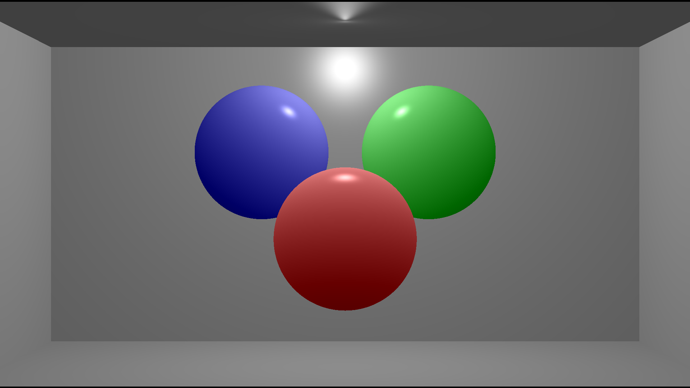

# Rust_Sandbox
repo for Rust learning, examples, projects, and practice  

## Projects: 
### rusty_tracer:
*a rust-based ray tracer implemented (mostly) from scratch by... me!*

- current iteration preview: ray-traced sphere with Phong illumination model

